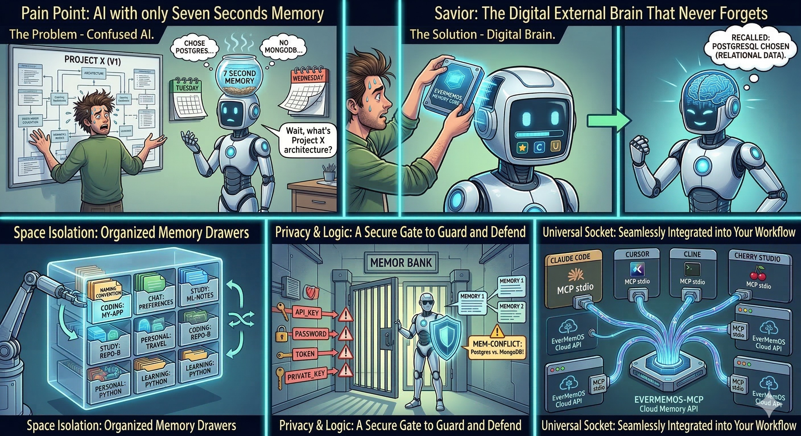

# evermemos-mcp

[](https://pypi.org/project/evermemos-mcp/)
[](https://pypi.org/project/evermemos-mcp/)
[](https://github.com/tt-a1i/evermemos-mcp/actions/workflows/ci.yml)
[](https://opensource.org/licenses/MIT)

[English](README.md) | [简体中文](README.zh-CN.md)

**Long-term memory for AI coding assistants. Remember once, recall forever.**



You spent thirty minutes explaining your architecture, naming conventions, and why you dropped MongoDB. Next session — gone. You explain it all over again.

evermemos-mcp fixes this. One `remember` call stores it. One `briefing` call brings it back — across any session, any client.

> **Benchmark: 60/60 recall vs 0/60 baseline. Zero attribution errors. P95 < 2s.** ([evidence](artifacts/competition/2026-02-26-formal-real-auto-all-v3/benchmark_summary.json))

> **Intro video:** [Watch on Bilibili](https://www.bilibili.com/video/BV1jMwhzKEVo)

> **Demo video:** [Watch on Bilibili](https://www.bilibili.com/video/BV13twWzuETU)

---

## Quick Start

Get your API key from [EverMemOS Cloud](https://evermind.ai/), then add to your MCP client config:

```json
{
  "mcpServers": {
    "evermemos-mcp": {
      "type": "stdio",
      "command": "uvx",
      "args": ["evermemos-mcp@latest"],
      "env": {
        "EVERMEMOS_API_KEY": "your-key-here"
      }
    }
  }
}
```

Or run directly:

```bash
uvx evermemos-mcp@latest
```

Works with **Claude Code, Cursor, Cline, Cherry Studio, OpenClaw, Gemini CLI, Aider**, and any MCP-compatible client or agent. See [`docs/05-client-integrations.md`](docs/05-client-integrations.md) for client-specific setup.

<details>
<summary>Install from source</summary>

```bash
git clone https://github.com/tt-a1i/evermemos-mcp.git
cd evermemos-mcp
cp .env.example .env   # set EVERMEMOS_API_KEY
uv run evermemos-mcp
```

MCP client config for source installs:

```json
{
  "mcpServers": {
    "evermemos-mcp": {
      "type": "stdio",
      "command": "uv",
      "args": ["run", "--directory", "/path/to/evermemos-mcp", "evermemos-mcp"],
      "env": { "EVERMEMOS_API_KEY": "your-key-here" }
    }
  }
}
```

</details>

---

## What You Get

### 7 Tools

| Tool | What it does |
|------|-------------|
| `list_spaces` | Discover available memory spaces |
| `remember` | Store context into long-term memory. Auto-detects sensitive content (API keys, passwords) and checks for conflicting memories |
| `request_status` | Check if a queued write has been extracted |
| `recall` | Search memories with 6 retrieval strategies (keyword / hybrid / vector / RRF / agentic / auto) |
| `briefing` | One-call session-start context restore: profile + episodes + facts + foresights |
| `forget` | Targeted deletion with verification workflow |
| `fetch_history` | Paginate through memory timeline by type |

### Key Capabilities

- **Space isolation** — `coding:my-app`, `chat:preferences`, `study:ml-notes` — memories never bleed across projects
- **Multi-space search** — Query up to 10 spaces in one `recall` call with automatic source attribution
- **Sensitive content guard** — Blocks API keys, passwords, tokens, private keys before storing. Asks user to confirm
- **Memory conflict detection** — Auto-checks for similar memories in `chat:*` spaces. Surfaces conflicts so the agent can decide
- **Lifecycle tracking** — Every result labeled `queued`, `provisional`, `fallback`, or `searchable` across all tools
- **Traceable citations** — `memory_type`, `snippet`, `timestamp`, `score`, `source_message_id` on every result
- **Git auto-detection** — Omit `space_id` and it infers `coding:<repo-name>` from git remote
- **Robust error handling** — Retry with backoff (429/5xx), GET body fallback for proxy/WAF, structured error codes

---

## Use Cases

**Persistent architecture context:**
```
You: remember we chose PostgreSQL because our data is highly relational
     [space_id: coding:my-saas]

-- next day, new session --

You: what database did we choose and why?
     → "Chose PostgreSQL — highly relational data model"
```

**Personal preferences that stick:**
```
You: remember I prefer dark mode, vim keybindings, and concise responses
     [space_id: chat:preferences]

-- any future session --

You: recall my UI preferences
     → "dark mode, vim keybindings, concise responses"
```

**Cross-session learning notes:**
```
You: remember bias-variance tradeoff — high bias = underfitting, high variance = overfitting
     [space_id: study:ml-notes]

-- later --

You: briefing for study:ml-notes
     → profile + recent episodes + key facts + foresights
```

---

## Why evermemos-mcp

There are other memory MCP servers. Here's what makes this one different:

| | evermemos-mcp | Mem0 MCP | Letta/MemGPT | Official MCP memory |
|---|---|---|---|---|
| **Space isolation** | `domain:slug` per project/topic | No | No | No |
| **Lifecycle tracking** | queued → provisional → fallback → searchable | No | No | No |
| **Sensitive content guard** | API keys, passwords, tokens blocked | No | No | No |
| **Conflict detection** | Auto for chat spaces | No | No | No |
| **Multi-space search** | Up to 10 spaces in one call | No | No | No |
| **Retrieval strategies** | 6 methods + auto merge | Semantic only | Semantic only | None |
| **Benchmark verified** | 60/60 recall, 0 errors | — | — | — |
| **Setup** | `uvx evermemos-mcp` | Cloud or self-host | Self-host required | `npx` |

---

## Benchmark

Tested on a fixed 60-query set across coding, chat, and study spaces.

| Metric | With memory | Without memory |
|--------|-------------|----------------|
| Hit rate | 60/60 (100%) | 0/60 (0%) |
| Attribution errors | 0 | — |
| P95 latency | 1958 ms | — |

Evidence:
- [`benchmark_summary.json`](artifacts/competition/2026-02-26-formal-real-auto-all-v3/benchmark_summary.json)
- [`benchmark_report.md`](artifacts/competition/2026-02-26-formal-real-auto-all-v3/benchmark_report.md)
- [`runs.jsonl` (release)](https://github.com/tt-a1i/evermemos-mcp/releases/tag/competition-evidence-2026-02-26)

---

## How It Works

```
MCP Client (Claude Code / Cursor / Cline / Cherry Studio / OpenClaw / any agent)
        │
        │  MCP stdio
        ▼
┌─────────────────────────────┐
│     evermemos-mcp server    │
│  ┌───────────────────────┐  │
│  │   7 Tool Handlers     │  │
│  └──────────┬────────────┘  │
│  ┌──────────▼────────────┐  │
│  │   Memory Service      │  │  Content guard → Conflict check → Cloud write → Lifecycle tracking
│  └──────────┬────────────┘  │
│  ┌──────────▼────────────┐  │
│  │ Space Catalog Service │  │  Space registry, metadata sync, cross-session recovery
│  └──────────┬────────────┘  │
│  ┌──────────▼────────────┐  │
│  │  EverMemOS HTTP Client│  │  Auth, retries, rate-limit backoff, error normalization
│  └──────────┬────────────┘  │
└─────────────┼───────────────┘
              │  HTTPS
              ▼
       EverMemOS Cloud API
```

- **Cloud-first** — All memories live in EverMemOS Cloud. No local state to lose.
- **Async extraction** — `remember` queues content for AI extraction. Use `request_status` to track progress.
- **Not a thin wrapper** — 2500+ lines of orchestration: fallback hierarchies, multi-method search merging, identity mirroring, partial failure recovery.

---

## Space Templates

| Template | Use it for |
|----------|------------|
| `chat:preferences` | Durable personal preferences, names, tone, UI likes |
| `chat:daily` | Ongoing chat context that shouldn't leak into projects |
| `coding:<repo>` | Architecture decisions, conventions, bugs, project context |
| `study:<topic>` | Learning notes, topic progress, revision context |

## Which Tool When

| Goal | Tool | Why |
|------|------|-----|
| Start a new session | `briefing` | Fastest way to restore context in one call |
| Find a specific fact | `recall` | Relevance-ranked search across spaces |
| Review what happened | `fetch_history` | Chronological timeline > ranked search for audits |
| Verify before/after delete | `fetch_history` | Stable timeline for pre/post-delete checks |

---

## Configuration

| Variable | Default | Description |
|----------|---------|-------------|
| `EVERMEMOS_API_KEY` | *(required)* | EverMemOS Cloud API key |
| `EVERMEMOS_USER_ID` | `mcp-user` | Default user identity |
| `EVERMEMOS_DEFAULT_SPACE` | *(auto)* | Default space. Auto-detected from git remote as `coding:<repo>` |
| `EVERMEMOS_BASE_URL` | `https://api.evermind.ai` | API endpoint |
| `EVERMEMOS_DEFAULT_TIMEZONE` | `UTC` | Timezone for metadata |
| `EVERMEMOS_ENABLE_CONVERSATION_META` | `true` | Sync conversation metadata |

<details>
<summary>Advanced configuration</summary>

| Variable | Default | Description |
|----------|---------|-------------|
| `EVERMEMOS_API_VERSION` | `v0` | API version |
| `EVERMEMOS_LLM_CUSTOM_SETTING_JSON` | — | Custom LLM extraction settings |
| `EVERMEMOS_USER_DETAILS_JSON` | — | User profile details for conversations |

</details>

### `flush` Rules

| Scenario | `flush` |
|----------|---------|
| Mid-conversation, more messages coming | `false` |
| End of session / topic switch / summary | `true` |
| Uncertain | `true` (safer) |

---

<details>
<summary><strong>Advanced: Memory Lifecycle States</strong></summary>

| State | Meaning |
|-------|---------|
| `queued` | Write accepted, extraction not yet confirmed |
| `provisional` | Answer from `pending_messages` while extraction is in progress |
| `fallback` | Answer from mirrored `conversation-meta`, not formal extracted memory |
| `searchable` | Answer from formal extracted memories |

All 7 tools expose compatible `lifecycle` blocks so agents always know memory maturity.

</details>

<details>
<summary><strong>Advanced: Forget Safety</strong></summary>

Cloud deletion is async and best-effort. evermemos-mcp provides a verification-first workflow:

1. Confirm target `memory_id` via `fetch_history` or `recall`
2. Call `forget(memory_ids=[...], space_id=...)`
3. Verify with `fetch_history`
4. If target persists, the lifecycle model surfaces this transparently

This is deliberate: expose real state to the agent rather than pretend deletion is instant.

</details>

---

## Development

```bash
uv sync --group dev       # Install dev dependencies
uv run ruff check         # Lint
uv run pytest             # Tests (285 pass)
```

## Documentation

| Document | Description |
|----------|-------------|
| [`docs/02-architecture.md`](docs/02-architecture.md) | Technical architecture |
| [`docs/05-client-integrations.md`](docs/05-client-integrations.md) | Client setup guides |
| [`docs/auto-memory-prompt.md`](docs/auto-memory-prompt.md) | Auto-memory prompt templates |
| [`docs/06-benchmark.md`](docs/06-benchmark.md) | Benchmark protocol |
| [`CHANGELOG.md`](CHANGELOG.md) | Version history |

## Also Check Out

**[MCO](https://github.com/mco-org/mco)** — Agent orchestration CLI. Let your main agent (Claude Code, Cursor, Aider) dispatch tasks to multiple coding agents in parallel. Pairs well with evermemos-mcp: MCO handles parallel execution, evermemos-mcp handles persistent memory.

## License

[MIT](https://opensource.org/licenses/MIT)
