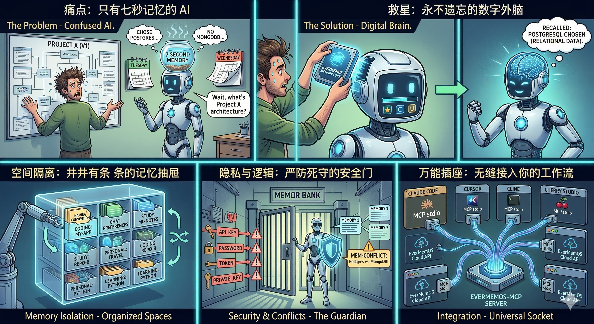

# evermemos-mcp

[](https://pypi.org/project/evermemos-mcp/)
[](https://pypi.org/project/evermemos-mcp/)
[](https://github.com/tt-a1i/evermemos-mcp/actions/workflows/ci.yml)
[](https://opensource.org/licenses/MIT)

[English](README.md) | [简体中文](README.zh-CN.md)

**AI 编程助手的长期记忆。记一次，永远记得。**



你花了半小时跟 AI 讲项目架构、命名规范、为什么放弃了 MongoDB。第二天开新会话——全忘了。你只好再讲一遍。

evermemos-mcp 解决这个问题。一次 `remember` 调用存下来，一次 `briefing` 调用恢复——跨会话、跨客户端。

> **Benchmark: 有记忆 60/60 命中 vs 无记忆 0/60。零归因错误。P95 < 2s。** ([证据](artifacts/competition/2026-02-26-formal-real-auto-all-v3/benchmark_summary.json))

> **简介视频：** [B站观看](https://www.bilibili.com/video/BV1jMwhzKEVo)

> **演示视频：** [B站观看](https://www.bilibili.com/video/BV13twWzuETU)

---

## 快速开始

从 [EverMemOS Cloud](https://evermind.ai/) 获取 API Key，然后添加到 MCP 客户端配置：

```json
{
  "mcpServers": {
    "evermemos-mcp": {
      "type": "stdio",
      "command": "uvx",
      "args": ["evermemos-mcp@latest"],
      "env": {
        "EVERMEMOS_API_KEY": "你的KEY"
      }
    }
  }
}
```

或直接运行：

```bash
uvx evermemos-mcp@latest
```

支持 **Claude Code、Cursor、Cline、Cherry Studio、OpenClaw、Gemini CLI、Aider** 及任何 MCP 兼容客户端和 Agent。各客户端配置详见 [`docs/05-client-integrations.zh-CN.md`](docs/05-client-integrations.zh-CN.md)。

<details>
<summary>从源码安装</summary>

```bash
git clone https://github.com/tt-a1i/evermemos-mcp.git
cd evermemos-mcp
cp .env.example .env   # 填入 EVERMEMOS_API_KEY
uv run evermemos-mcp
```

源码安装的 MCP 客户端配置：

```json
{
  "mcpServers": {
    "evermemos-mcp": {
      "type": "stdio",
      "command": "uv",
      "args": ["run", "--directory", "/你的绝对路径/evermemos-mcp", "evermemos-mcp"],
      "env": { "EVERMEMOS_API_KEY": "你的KEY" }
    }
  }
}
```

</details>

---

## 功能一览

### 7 个工具

| 工具 | 说明 |
|------|------|
| `list_spaces` | 发现可用的记忆空间 |
| `remember` | 将信息存入长期记忆。自动检测敏感内容（API 密钥、密码），对 chat 空间检查记忆冲突 |
| `request_status` | 查询写入是否已完成提取 |
| `recall` | 搜索记忆，支持 6 种检索策略（关键词 / 混合 / 向量 / RRF / 智能体 / 自动） |
| `briefing` | 一键恢复会话上下文：用户画像 + 情景 + 事实 + 前瞻 |
| `forget` | 验证优先的定向删除 |
| `fetch_history` | 按类型分页浏览记忆时间线 |

### 核心特性

- **空间隔离** — `coding:my-app`、`chat:preferences`、`study:ml-notes` — 不同项目记忆互不干扰
- **多空间检索** — 单次 `recall` 可查询最多 10 个空间，自动标注来源
- **敏感内容守卫** — 存储前自动检测 API 密钥、密码、Token、私钥，阻止写入并提示用户确认
- **记忆冲突检测** — 对 `chat:*` 空间自动检查相似记忆，将冲突项返回给 Agent 决定
- **生命周期追踪** — 所有结果标注 `queued`、`provisional`、`fallback` 或 `searchable`
- **可追溯引用** — 每条结果包含 `memory_type`、`snippet`、`timestamp`、`score`、`source_message_id`
- **Git 自动推断** — 省略 `space_id` 时自动从 git remote 推断 `coding:<仓库名>`
- **健壮的错误处理** — 429/5xx 自动退避重试；legacy v0 的 GET body 代理/WAF 兼容回退（默认 v1 fetch/search 使用 POST body）；结构化错误码

---

## 使用场景

**持久化架构上下文：**
```
你：记住我们选择 PostgreSQL 因为数据高度关联
    [space_id: coding:my-saas]

—— 第二天，新会话 ——

你：我们选了什么数据库？为什么？
    → "选择 PostgreSQL — 数据模型高度关联"
```

**个人偏好持久化：**
```
你：记住我偏好暗色主题、vim 快捷键、简洁回复
    [space_id: chat:preferences]

—— 任意后续会话 ——

你：回忆我的 UI 偏好
    → "暗色主题、vim 快捷键、简洁回复"
```

**跨会话学习笔记：**
```
你：记住 bias-variance tradeoff — 高 bias = 欠拟合，高 variance = 过拟合
    [space_id: study:ml-notes]

—— 之后 ——

你：给我 study:ml-notes 的简报
    → 用户画像 + 近期情景 + 关键事实 + 前瞻预测
```

---

## 为什么选 evermemos-mcp

市面上有不少记忆 MCP 服务器，这个有什么不同：

| | evermemos-mcp | Mem0 MCP | Letta/MemGPT | 官方 MCP memory |
|---|---|---|---|---|
| **空间隔离** | `domain:slug` 按项目/主题分离 | 无 | 无 | 无 |
| **生命周期追踪** | queued → provisional → fallback → searchable | 无 | 无 | 无 |
| **敏感内容守卫** | API 密钥、密码、Token 拦截 | 无 | 无 | 无 |
| **冲突检测** | chat 空间自动检测 | 无 | 无 | 无 |
| **多空间检索** | 单次查询最多 10 个空间 | 无 | 无 | 无 |
| **检索策略** | 6 种方法 + 自动融合 | 仅语义 | 仅语义 | 无 |
| **Benchmark 验证** | 60/60 命中，0 错误 | — | — | — |
| **安装** | `uvx evermemos-mcp` | 云端或自部署 | 需自部署 | `npx` |

---

## Benchmark

基于固定 60 条查询集，覆盖 coding、chat、study 三类空间。

| 指标 | 有记忆 | 无记忆 |
|------|--------|--------|
| 命中率 | 60/60 (100%) | 0/60 (0%) |
| 归因错误 | 0 | — |
| P95 延迟 | 1958 ms | — |

证据：
- [`benchmark_summary.json`](artifacts/competition/2026-02-26-formal-real-auto-all-v3/benchmark_summary.json)
- [`benchmark_report.md`](artifacts/competition/2026-02-26-formal-real-auto-all-v3/benchmark_report.md)
- [`runs.jsonl` (release)](https://github.com/tt-a1i/evermemos-mcp/releases/tag/competition-evidence-2026-02-26)

---

## 架构

```
MCP 客户端（Claude Code / Cursor / Cline / Cherry Studio / OpenClaw / 任意 Agent）
        │
        │  MCP stdio
        ▼
┌─────────────────────────────┐
│     evermemos-mcp 服务器     │
│  ┌───────────────────────┐  │
│  │    7 个工具处理器       │  │
│  └──────────┬────────────┘  │
│  ┌──────────▼────────────┐  │
│  │     记忆服务层         │  │  内容守卫 → 冲突检查 → Cloud 写入 → 生命周期追踪
│  └──────────┬────────────┘  │
│  ┌──────────▼────────────┐  │
│  │   空间目录服务         │  │  空间注册、元数据同步、跨会话恢复
│  └──────────┬────────────┘  │
│  ┌──────────▼────────────┐  │
│  │  EverMemOS HTTP 客户端 │  │  认证、重试、限流退避、错误规范化
│  └──────────┬────────────┘  │
└─────────────┼───────────────┘
              │  HTTPS
              ▼
       EverMemOS Cloud API
```

- **Cloud 优先** — 所有记忆存储在 EverMemOS Cloud，无本地状态可丢失
- **异步提取** — `remember` 将内容排入队列由 AI 提取，用 `request_status` 追踪进度
- **不是薄封装** — 2500+ 行编排：回退层级、多方法搜索融合、身份镜像、局部失败恢复

---

## 空间模板

| 模板 | 适合存什么 |
|------|------------|
| `chat:preferences` | 长期个人偏好、名字、称呼、语气、UI 喜好 |
| `chat:daily` | 持续聊天上下文，不应混入项目记忆 |
| `coding:<repo>` | 架构决策、项目惯例、Bug 根因、项目上下文 |
| `study:<topic>` | 学习笔记、主题进度、复盘上下文 |

## 工具选择指南

| 目标 | 工具 | 原因 |
|------|------|------|
| 开始新会话 | `briefing` | 一次调用恢复完整上下文 |
| 找特定信息 | `recall` | 按相关性排序的跨空间搜索 |
| 按时间回看 | `fetch_history` | 时间线回顾比相关性排序更可靠 |
| 删除前后核验 | `fetch_history` | 稳定时间线适合删前删后对比 |

---

## 配置项

| 变量 | 默认值 | 说明 |
|------|--------|------|
| `EVERMEMOS_API_KEY` | *（必填）* | EverMemOS Cloud API Key |
| `EVERMEMOS_USER_ID` | `mcp-user` | 默认用户身份 |
| `EVERMEMOS_DEFAULT_SPACE` | *（自动）* | 默认空间。从 git remote 自动推断为 `coding:<仓库名>` |
| `EVERMEMOS_BASE_URL` | `https://api.evermind.ai` | API 地址 |
| `EVERMEMOS_DEFAULT_TIMEZONE` | `UTC` | 元数据时区 |
| `EVERMEMOS_ENABLE_CONVERSATION_META` | `true` | 是否同步会话元数据 |

<details>
<summary>高级配置</summary>

| 变量 | 默认值 | 说明 |
|------|--------|------|
| `EVERMEMOS_API_VERSION` | `v1` | API 版本（`v0` 为旧版兼容） |
| `EVERMEMOS_LLM_CUSTOM_SETTING_JSON` | — | 自定义 LLM 提取设置 |
| `EVERMEMOS_USER_DETAILS_JSON` | — | 会话用户详情 |

</details>

### `flush` 规则

| 场景 | `flush` |
|------|---------|
| 对话进行中，还有后续消息 | `false` |
| 会话结束 / 话题切换 / 总结 | `true` |
| 不确定 | `true`（更稳妥） |

---

<details>
<summary><strong>进阶：记忆生命周期状态</strong></summary>

| 状态 | 含义 |
|------|------|
| `queued` | 写入已接受，提取尚未确认 |
| `provisional` | 结果来自 `pending_messages`，提取仍在进行 |
| `fallback` | 当前答案来自 `pending_messages` 和/或 metadata fallback（正式记忆尚未可检索）；Cloud v1 下仅有 Groups API 的有限字段（如 name/description）可被 durable 镜像 |
| `searchable` | 结果来自正式提取后的记忆 |

所有 7 个工具输出兼容的 `lifecycle` 字段，Agent 始终可知记忆成熟度。

</details>

<details>
<summary><strong>进阶：Forget 安全说明</strong></summary>

Cloud 端删除是异步的 best-effort 操作。evermemos-mcp 提供验证优先的工作流：

1. 通过 `fetch_history` 或 `recall` 确认目标 `memory_id`
2. 调用 `forget(memory_ids=[...], space_id=...)`
3. 用 `fetch_history` 复查
4. 如果目标仍存在，生命周期模型会透明地呈现这一状态

这是有意为之：把真实状态暴露给 Agent，而不是假装删除是即时的。

</details>

---

## 开发

```bash
uv sync --group dev       # 安装开发依赖
uv run ruff check         # 代码检查
uv run pytest             # 测试（285 通过）
```

## 文档

| 文档 | 说明 |
|------|------|
| [`docs/02-architecture.zh-CN.md`](docs/02-architecture.zh-CN.md) | 技术架构 |
| [`docs/05-client-integrations.zh-CN.md`](docs/05-client-integrations.zh-CN.md) | 客户端接入指南 |
| [`docs/auto-memory-prompt.zh-CN.md`](docs/auto-memory-prompt.zh-CN.md) | 自动记忆 Prompt 模板 |
| [`docs/06-benchmark.md`](docs/06-benchmark.md) | Benchmark 协议 |
| [`CHANGELOG.md`](CHANGELOG.md) | 版本历史 |

## 相关项目

**[MCO](https://github.com/mco-org/mco)** — Agent 编排 CLI 工具。让你的主 Agent（Claude Code、Cursor、Aider）把任务分发给多个编程 Agent 并行执行。和 evermemos-mcp 搭配使用：MCO 负责并行调度，evermemos-mcp 负责持久记忆。

## License

[MIT](https://opensource.org/licenses/MIT)
